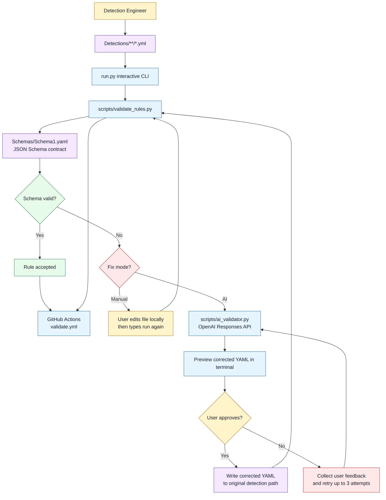

# Elastic Detection-as-Code (DaC) for Elastic SIEM with AI-Assisted Rule Repair

[](https://github.com/GBinion2020/Elastic-Detection-as-Code/actions/workflows/validate.yml)

This repository implements a Detection-as-Code pipeline for Elastic SIEM where detection content is treated like software: authored in version control, validated against a schema contract, corrected through a human-in-the-loop AI remediation engine, and prepared for deployment.

## Why this project exists

Detection engineering quality fails most often in three places:

- Rule structure drift: missing or malformed fields break downstream ingestion.
- Query language formatting: YAML or query mistakes block deployment or produce incorrect matching behavior.
- Review bottlenecks: manual correction cycles are slow and inconsistent.

This project addresses those failure modes by combining strict schema validation with an interactive remediation workflow centered on AI-assisted correction, with analyst approval gates before write-back.

## Research-grade architecture overview

The system uses a staged governance model with AI as the primary remediation accelerator:

1. Authoring layer: analysts create or update rules under `Detections/**/*.yml`.
2. Contract layer: rules must satisfy `Schemas/Schema1.yaml`, a JSON Schema contract for Elastic query-based detections.
3. Remediation layer: failing rules are routed to an interactive decision point where users choose manual editing or AI correction.
4. Assurance layer: every corrected rule is revalidated before write-back and before CI passes.

The schema contract is designed for Elastic detection rule structure and Elastic query workflows (for example `language: kuery` for KQL-based detections), with strict typing for critical fields such as `risk_score`, `severity`, `enabled`, `index`, `tags`, and `references`.

## AI remediation engine

The AI pipeline is a first-class component, not an add-on:

- `scripts/ai_validator.py` sends invalid detection YAML to the OpenAI Responses API with strict editing constraints.
- The model proposes corrected YAML only; the output is revalidated against schema before any write occurs.
- `run.py` prints the candidate in terminal, collects analyst approval, and supports iterative feedback loops.
- If rejected, the user can provide revision guidance and the model retries (up to 3 attempts by default).
- If approved, the corrected rule is written back to its original file path and revalidated.
- If not approved after max attempts, the original detection content can be preserved unchanged.

## System flow diagram



## Repository structure

- `Detections/`: detection content authored as YAML files.
- `Schemas/Schema1.yaml`: JSON Schema used to validate Elastic rule structure.
- `run.py`: root interactive CLI for validation and guided remediation.
- `scripts/validate_rules.py`: non-interactive validator used locally and in CI.
- `scripts/ai_validator.py`: AI-assisted fixer with schema-aware retry logic.
- `.github/workflows/validate.yml`: CI workflow for dependency install and validation.
- `scripts/deploy_rules.py`: optional deployment helper for pushing rules to Kibana.

## Core workflows

### 1) Interactive local workflow (recommended, AI-first)

Run from repo root:

```bash
python3 run.py
```

What happens:

1. CLI asks whether to test detections.
2. It validates all detection files against `Schemas/Schema1.yaml`.
3. For each failing file, it asks:
   - `manual`: you edit and type `run again`.
   - `ai`: model proposes a corrected YAML candidate.
4. AI candidate is shown in terminal for review before write-back.
5. You approve or reject with feedback; AI retries up to 3 times.
6. Final result is revalidated globally before success.

### 2) Non-interactive validation (CI-compatible)

```bash
python3 scripts/validate_rules.py --no-ai-fix
```

Or allow auto-fix handoff:

```bash
python3 scripts/validate_rules.py
```

### 3) Direct AI fixer usage (targeted files)

```bash
python3 scripts/ai_validator.py --files "Detections/Windows/test_fail.yml" --model gpt-5.2
```

## Setup instructions

### Prerequisites

- Python 3.10+
- `pip`
- OpenAI API key (for AI remediation)
- Optional: Elastic/Kibana API access for deployment

### Install dependencies

```bash
python3 -m pip install -r requirements.txt
```

### Configure environment variables (required for AI remediation)

Create `.env` in repo root:

```bash
OPENAI_API_KEY=sk-...
OPENAI_MODEL=gpt-5.2
```

Compatibility aliases are also supported:

- `OPENAI_API` (alias for `OPENAI_API_KEY`)
- `MODEL` (alias for `OPENAI_MODEL`)

## CI behavior (AI-aware validation)

The workflow in `.github/workflows/validate.yml`:

1. Installs dependencies from `requirements.txt`.
2. Runs `scripts/validate_rules.py`.
3. Uses `OPENAI_API_KEY` and `OPENAI_MODEL` from workflow environment for AI-assisted repair when needed.

Recommended GitHub secret:

- `OPENAI_API_KEY`

## Schema contract details

`Schemas/Schema1.yaml` enforces:

- Required identifiers and metadata: `rule_id`, `name`, `description`, `author`, `version`.
- Query structure for Elastic query detections: `type`, `language`, `query`, `index`.
- Risk semantics: `severity` enum and bounded integer `risk_score`.
- Boolean state control: `enabled`.
- Minimum list quality constraints: `tags`, `references`, and `index`.

This contract is intentionally strict to reduce deployment failures and preserve operational consistency in Elastic SIEM.

## Security and operational notes

- Never commit live API keys to version control.
- Rotate keys immediately if exposed.
- Use least-privilege API keys for deployment and remediation tasks.
- Validate all AI-proposed rules before approving write-back.

## Quick start for contributors

```bash
git clone https://github.com/GBinion2020/Elastic-Detection-as-Code.git
cd Elastic-Detection-as-Code
python3 -m pip install -r requirements.txt
python3 run.py
```
