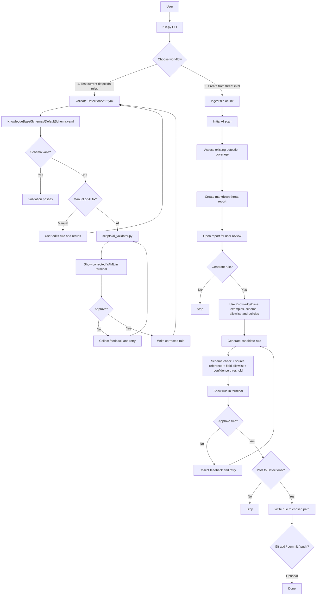

# Elastic Detection-as-Code with Threat Intel to Rule Workflow

[](https://github.com/GBinion2020/Elastic-Detection-as-Code/actions/workflows/validate.yml)

This project is a high-level Detection-as-Code workflow for Elastic SIEM. It helps analysts do two core jobs:

- validate and repair existing detection rules
- turn threat-intelligence reports into reviewable detection content with human approval gates

The system is designed so AI helps with speed, but people stay in control of what gets accepted, written, committed, and pushed.

## Why this exists

Detection engineering usually breaks down in a few predictable places:

- rule YAML drifts away from the required schema
- query logic is valid-looking but inconsistent with house style
- threat intel is useful, but turning it into a reliable detection takes too long
- teams lack a repeatable review process before rules are written into the repository

This repository addresses that by combining:

- schema validation
- AI-assisted repair and generation
- a knowledge base of working examples and guardrails
- explicit user review before anything is written

## What the workflow does

At a high level, the CLI supports two paths:

1. Validate current detections already in `Detections/`
2. Ingest threat intel from a file or link, summarize it, assess whether coverage already exists, generate a reviewable markdown report, and optionally create a new detection rule

## End-to-End Workflow


```mermaid
flowchart TD
    U[User] --> CLI[run.py CLI]

    CLI --> CHOICE{Choose workflow}

    CHOICE -->|1. Test current detection rules| VALIDATE[Validate Detections/**/*.yml]
    VALIDATE --> SCHEMA[KnowledgeBase/Schemas/DefaultSchema.yaml]
    SCHEMA --> VALID{Schema valid?}
    VALID -->|Yes| PASS[Validation passes]
    VALID -->|No| FIXMODE{Manual or AI fix?}
    FIXMODE -->|Manual| MANUAL[User edits rule and reruns]
    MANUAL --> VALIDATE
    FIXMODE -->|AI| AIFIX[scripts/ai_validator.py]
    AIFIX --> FIXPREVIEW[Show corrected YAML in terminal]
    FIXPREVIEW --> FIXAPPROVE{Approve?}
    FIXAPPROVE -->|No| FIXFEEDBACK[Collect feedback and retry]
    FIXFEEDBACK --> AIFIX
    FIXAPPROVE -->|Yes| FIXWRITE[Write corrected rule]
    FIXWRITE --> VALIDATE

    CHOICE -->|2. Create from threat intel| INGEST[Ingest file or link]
    INGEST --> SCAN[Initial AI scan]
    SCAN --> COVERAGE[Assess existing detection coverage]
    COVERAGE --> REPORT[Create markdown threat report]
    REPORT --> OPEN[Open report for user review]
    OPEN --> GENQ{Generate rule?}
    GENQ -->|No| STOP1[Stop]
    GENQ -->|Yes| KB[Use KnowledgeBase examples, schema, allowlist, and policies]
    KB --> GENRULE[Generate candidate rule]
    GENRULE --> GUARDS[Schema check + source reference + field allowlist + confidence threshold]
    GUARDS --> RULEVIEW[Show rule in terminal]
    RULEVIEW --> RULEOK{Approve rule?}
    RULEOK -->|No| RULEFEEDBACK[Collect feedback and retry]
    RULEFEEDBACK --> GENRULE
    RULEOK -->|Yes| SAVEQ{Post to Detections/?}
    SAVEQ -->|No| STOP2[Stop]
    SAVEQ -->|Yes| WRITE[Write rule to chosen path]
    WRITE --> GITQ{Git add / commit / push?}
    GITQ -->|Optional| DONE[Done]
```

## How it works

### 1. Existing rule validation

The validation path checks all detection YAML files against the default schema:

- schema path: `KnowledgeBase/Schemas/DefaultSchema.yaml`
- target content: `Detections/**/*.yml`

If a rule fails validation, the user can:

- fix it manually and rerun validation
- let AI propose a corrected version

AI-proposed fixes are always shown in the terminal first. The user can reject them, request changes, or approve them before the file is updated.

### 2. Threat intel to detection workflow

The threat-intel path starts from either:

- a local file uploaded to OpenAI for analysis
- a URL analyzed through OpenAI web search

The system then:

- performs an initial scan of the report
- extracts IOCs and attack logic
- identifies impacted systems and likely targets
- checks whether current detections already cover the observed risk
- generates a short markdown report for analyst review
- renders a Mermaid diagram of the attack flow inside that report

After review, the user can choose whether to generate a detection rule.

### 3. Rule generation with guardrails

If the user chooses to generate a rule, the AI receives:

- the reviewed markdown threat report
- the default schema
- a knowledge base of house-style detection examples
- a query field allowlist
- workflow policy settings such as minimum confidence

The generated rule must pass these checks before it can move forward:

- schema validation succeeds
- the rule includes at least one reference back to the original intel source
- the query only uses allowed field names
- the threat scan confidence meets the configured threshold

The rule is then shown in the terminal for review. The user can request revisions before deciding whether to write it into `Detections/`.

### 4. Controlled write and git flow

The tool does not immediately post generated detections.

Instead it:

- suggests a target output path
- asks before creating a new file
- asks before creating a new folder
- asks before overwriting an existing file
- asks whether to `git add`
- asks whether to `git commit`
- asks whether to `git push`

No delete operation is part of the workflow.

## Repository layout

### Main folders

- `Detections/`  
  Detection rules that are intended for use in the SIEM.

- `KnowledgeBase/`  
  Shared context used to guide AI behavior and validation.

- `prompts/`  
  Prompt files used by the threat-intel scan and rule-generation workflows.

- `scripts/`  
  Workflow and API helper modules.

### Knowledge base contents

- `KnowledgeBase/Schemas/DefaultSchema.yaml`  
  The default validation contract for Elastic detection rules.

- `KnowledgeBase/DetectionExamples/Elastic_Query_Style_Examples/`  
  Neutral example rules derived from working detection patterns already accepted by the SIEM.

- `KnowledgeBase/Guides/Elastic_Query_Style_Guide.md`  
  High-level guidance for query shape, metadata style, and rule structure.

- `KnowledgeBase/Policies/Elastic_Query_Field_Allowlist.txt`  
  Allowed query field names for generated rules.

- `KnowledgeBase/Policies/ThreatIntelWorkflow.yaml`  
  Workflow guardrails such as minimum scan confidence.

## Core components

- `run.py`  
  Main interactive CLI for both validation and threat-intel workflows.

- `scripts/validate_rules.py`  
  Non-interactive validator for local use and CI.

- `scripts/ai_validator.py`  
  AI-assisted rule repair for invalid detections.

- `scripts/file_requests.py`  
  Handles file-based threat-intel submission to OpenAI.

- `scripts/web_requests.py`  
  Handles link-based threat-intel analysis through OpenAI web search.

- `scripts/threat_intel_workflow.py`  
  Coordinates the threat-intel scan, report generation, guardrails, and rule generation.

## Setup

### Prerequisites

- Python 3.10+
- `pip`
- OpenAI API key

### Install dependencies

```bash
python3 -m pip install -r requirements.txt
```

### Configure environment

Create a `.env` file in the repository root:

```bash
OPENAI_API_KEY=sk-...
OPENAI_MODEL=gpt-5.2
```

Supported aliases:

- `OPENAI_API` for `OPENAI_API_KEY`
- `MODEL` for `OPENAI_MODEL`

## How to use

### Interactive CLI

Run:

```bash
python3 run.py
```

You will then choose:

1. `Test current detection rules`
2. `Create a detection rule from threat intel`

### Validate current detections

This path:

- loads the default schema
- checks detections under `Detections/`
- offers manual or AI-assisted repair for invalid rules
- revalidates before completion

### Build from threat intel

This path:

- accepts a file or link
- creates and opens a markdown report
- asks whether to generate a rule
- asks for target system, language, and schema choice
- previews the generated rule in terminal
- allows iterative revision
- optionally writes the approved rule
- optionally stages, commits, and pushes it

## Example commands

### Run the main workflow

```bash
python3 run.py
```

### Validate all rules non-interactively

```bash
python3 scripts/validate_rules.py --no-ai-fix
```

### Validate and allow AI fixer

```bash
python3 scripts/validate_rules.py
```

## CI

GitHub Actions runs repository validation through the existing workflow:

- install dependencies
- validate rules
- fail the build if the rule set is invalid

Recommended secret:

- `OPENAI_API_KEY`

## Design principles

- AI assists, humans approve
- guardrails are enforced in code, not just in prompts
- schema validation is mandatory
- query style should stay consistent with working in-repo patterns
- threat intel should produce a review artifact before producing a rule

## Security notes

- never commit live API keys
- rotate keys immediately if exposed
- use least-privilege credentials where possible
- review AI output before accepting it

## Quick start

```bash
git clone https://github.com/GBinion2020/Elastic-Detection-as-Code.git
cd Elastic-Detection-as-Code
python3 -m pip install -r requirements.txt
python3 run.py
```
