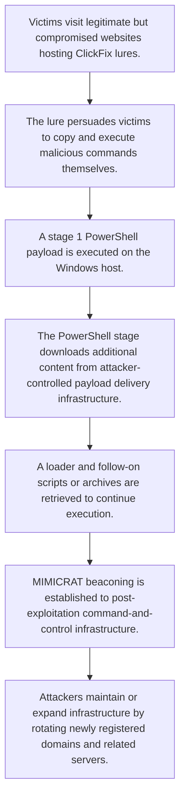

# Investigations into the MIMICRAT ClickFix campaign

- Source: clickfix
- Intake mode: link
- Reference: https://www.stormshield.com/news/investigations-into-the-mimicrat-clickfix-campaign/
- Risk level: high
- Confidence: high

## Executive Summary
Stormshield reports an ongoing ClickFix campaign delivering MIMICRAT through legitimate but compromised websites. Victims are socially engineered to copy and execute malicious commands, leading to staged PowerShell execution, payload retrieval from attacker-controlled infrastructure, and post-infection command-and-control. Stormshield expanded the known infrastructure with additional payload delivery IPs, numerous related domains, and several SHA-256 hashes tied to PowerShell scripts, a ZIP archive, and certificates. The current detection catalog already contains a materially relevant detection specifically aligned to this MIMICRAT ClickFix PowerShell behavior.

## Attack Diagram

## Existing Detection Coverage
- Coverage exists: yes
- Coverage summary: The catalog contains one strong, campaign-specific overlap. It directly targets suspicious PowerShell with AMSI or ETW bypass behavior linked to the MIMICRAT ClickFix activity described in the source. The remaining detections are largely unrelated APT29- or PsExec-specific rules and do not materially match the observed campaign behavior.

- `Detections/elastic/mimicrat_clickfix_campaign_delivering_custom_rat_via_compromised_legitimate_websites_eql.yml`: Directly aligned to the reported MIMICRAT ClickFix campaign and detects obfuscated or bypass-oriented PowerShell behaviors described as part of the staged downloader and second-stage execution chain.

## Attack Logic
- Victims visit legitimate but compromised websites hosting ClickFix lures.
- The lure persuades victims to copy and execute malicious commands themselves.
- A stage 1 PowerShell payload is executed on the Windows host.
- The PowerShell stage downloads additional content from attacker-controlled payload delivery infrastructure.
- A loader and follow-on scripts or archives are retrieved to continue execution.
- MIMICRAT beaconing is established to post-exploitation command-and-control infrastructure.
- Attackers maintain or expand infrastructure by rotating newly registered domains and related servers.

## Impacted Systems
- Windows
- Compromised websites used as delivery vectors
- Web browsing environments where users can execute copied commands

## Likely Targets
- Users visiting compromised legitimate websites
- Windows endpoints
- Organizations exposed to social-engineering-driven ClickFix lures

## TTPs
- ClickFix social engineering
- User-executed malicious copy-and-paste commands
- PowerShell-based staged payload delivery
- BITS-based file download
- Silent MSI installation via msiexec
- Remote access trojan deployment
- Command and control over attacker-controlled web infrastructure
- Infrastructure rotation through newly registered lookalike domains

## Tooling And Malware
- MIMICRAT
- PowerShell
- msiexec.exe
- Start-BitsTransfer
- GoBuster

## Indicators Of Compromise
| Type | Value | Context |
| --- | --- | --- |
| sha256 | bcc7a0e53ebc62c77b7b6e3585166bfd7164f65a8115e7c8bda568279ab4f6f1 | Stage 1 PowerShell payload |
| sha256 | 5e0a30d8d91d5fd46da73f3e6555936233d870ac789ca7dd64c9d3cc74719f51 | Lua loader |
| sha256 | a508d0bb583dc6e5f97b6094f8f910b5b6f2b9d5528c04e4dee62c343fce6f4b | MIMICRAT beacon |
| sha256 | 055336daf2ac9d5bbc329fd52bb539085d00e2302fa75a0c7e9d52f540b28beb | Related beacon sample |
| ip | 45.13.212.250 | Payload delivery infrastructure |
| ip | 45.13.212.251 | Payload delivery infrastructure |
| ip | 23.227.202.114 | Post-exploitation C2 |
| domain | xmri.network | Payload delivery infrastructure |
| domain | wexmri.cc | Payload delivery infrastructure |
| domain | www.ndibstersoft.com | Post-exploitation C2 |
| domain | d15mawx0xveem1.cloudfront.net | Post-exploitation C2 |
| ip | 94.156.35.16 | Payload delivery infrastructure |
| ip | 94.156.189.210 | Payload delivery infrastructure |
| ip | 185.205.210.95 | Payload delivery infrastructure |
| ip | 185.177.59.102 | Payload delivery infrastructure |
| ip | 193.37.213.18 | Payload delivery infrastructure |
| domain | avserivce.network | Payload delivery infrastructure |
| domain | avumanager.network | Payload delivery infrastructure |
| domain | connectmanager.network | Payload delivery infrastructure |
| domain | msservice.network | Payload delivery infrastructure |
| domain | plugins-manager.network | Payload delivery infrastructure |
| domain | msmanager.network | Payload delivery infrastructure |
| domain | www.avumanager.network | Payload delivery infrastructure |
| domain | www.connectmanager.network | Payload delivery infrastructure |
| domain | www.msmanager.network | Payload delivery infrastructure |
| domain | www.avserivce.network | Payload delivery infrastructure |
| domain | www.plugins-manager.network | Payload delivery infrastructure |
| domain | www.wexmri.cc | Payload delivery infrastructure |
| domain | winplugins.lat | Payload delivery infrastructure |
| domain | mriwex.lat | Payload delivery infrastructure |
| domain | myservice.lat | Payload delivery infrastructure |
| domain | updtils.lat | Payload delivery infrastructure |
| domain | wiutils.lat | Payload delivery infrastructure |
| domain | wexmri.lat | Payload delivery infrastructure |
| domain | www.mriwex.lat | Payload delivery infrastructure |
| domain | www.msservice.network | Payload delivery infrastructure |
| domain | avprog.cc | Payload delivery infrastructure |
| domain | avservice.cc | Payload delivery infrastructure |
| domain | avsprog.cc | Payload delivery infrastructure |
| domain | enixwegemtir.cc | Payload delivery infrastructure |
| domain | ieservice.cc | Payload delivery infrastructure |
| domain | lmsevice.cc | Payload delivery infrastructure |
| domain | msconfig.cc | Payload delivery infrastructure |
| domain | msprog.cc | Payload delivery infrastructure |
| domain | mupadete.network | Payload delivery infrastructure |
| domain | myazbuk.network | Payload delivery infrastructure |
| domain | mybulk.network | Payload delivery infrastructure |
| domain | mynext.network | Payload delivery infrastructure |
| domain | platamy.network | Payload delivery infrastructure |
| domain | servispro.network | Payload delivery infrastructure |
| domain | uiservice.cc | Payload delivery infrastructure |
| domain | winntservice.cc | Payload delivery infrastructure |
| domain | winservice.cc | Payload delivery infrastructure |
| domain | www.avprog.cc | Payload delivery infrastructure |
| domain | www.msconfig.cc | Payload delivery infrastructure |
| domain | www.avservice.cc | Payload delivery infrastructure |
| domain | www.enixwegemtir.cc | Payload delivery infrastructure |
| domain | www.myazbuk.network | Payload delivery infrastructure |
| domain | www.platamy.network | Payload delivery infrastructure |
| domain | www.servispro.network | Payload delivery infrastructure |
| domain | www.winntservice.cc | Payload delivery infrastructure |
| domain | www.winservice.cc | Payload delivery infrastructure |
| domain | www.lmsevice.cc | Payload delivery infrastructure |
| domain | www.mupadete.network | Payload delivery infrastructure |
| domain | www.avsprog.cc | Payload delivery infrastructure |
| domain | www.ieservice.cc | Payload delivery infrastructure |
| domain | www.mynext.network | Payload delivery infrastructure |
| domain | www.uiservice.cc | Payload delivery infrastructure |
| domain | www.msprog.cc | Payload delivery infrastructure |
| domain | www.mybulk.network | Payload delivery infrastructure |
| domain | www.xmri.network | Payload delivery infrastructure |
| domain | mispolishal.com | Payload delivery infrastructure |
| domain | queryize.com | Payload delivery infrastructure |
| domain | www.queryize.com | Payload delivery infrastructure |
| domain | refootful.com | Payload delivery infrastructure |
| domain | www.refootful.com | Payload delivery infrastructure |
| domain | servicemodel.net | Payload delivery infrastructure |
| domain | www.servicemodel.net | Payload delivery infrastructure |
| domain | misdeskize.live | Payload delivery infrastructure |
| domain | mismodelise.live | Payload delivery infrastructure |
| domain | nontextileify.live | Payload delivery infrastructure |
| domain | overshorer.live | Payload delivery infrastructure |
| domain | prebrakeible.live | Payload delivery infrastructure |
| domain | precampusic.live | Payload delivery infrastructure |
| domain | rebaby.live | Payload delivery infrastructure |
| domain | unadvisehood.live | Payload delivery infrastructure |
| domain | underfollowship.live | Payload delivery infrastructure |
| domain | untheories.live | Payload delivery infrastructure |
| domain | www.misdeskize.live | Payload delivery infrastructure |
| domain | www.unadvisehood.live | Payload delivery infrastructure |
| domain | www.overshorer.live | Payload delivery infrastructure |
| domain | www.prebrakeible.live | Payload delivery infrastructure |
| domain | www.precampusic.live | Payload delivery infrastructure |
| domain | www.rebaby.live | Payload delivery infrastructure |
| domain | www.untheories.live | Payload delivery infrastructure |
| domain | www.mismodelise.live | Payload delivery infrastructure |
| domain | www.nontextileify.live | Payload delivery infrastructure |
| domain | www.underfollowship.live | Payload delivery infrastructure |
| domain | mislated.pics | Payload delivery infrastructure |
| domain | originateal.pics | Payload delivery infrastructure |
| domain | overuserness.pics | Payload delivery infrastructure |
| domain | prebarleylike.pics | Payload delivery infrastructure |
| domain | rewritingment.pics | Payload delivery infrastructure |
| domain | www.mislated.pics | Payload delivery infrastructure |
| domain | www.originateal.pics | Payload delivery infrastructure |
| domain | www.overuserness.pics | Payload delivery infrastructure |
| domain | www.prebarleylike.pics | Payload delivery infrastructure |
| domain | www.rewritingment.pics | Payload delivery infrastructure |
| domain | imagesping.com | Payload delivery infrastructure |
| domain | jquerymanager.com | Payload delivery infrastructure |
| domain | pingimages.com | Payload delivery infrastructure |
| domain | regularexpressions.re | Payload delivery infrastructure |
| domain | www.jquerymanager.com | Payload delivery infrastructure |
| domain | www.pingimages.com | Payload delivery infrastructure |
| domain | www.regularexpressions.re | Payload delivery infrastructure |
| domain | www.imagesping.com | Payload delivery infrastructure |
| domain | binchecks.info | Payload delivery infrastructure |
| domain | cachek.info | Payload delivery infrastructure |
| domain | cfcheck.info | Payload delivery infrastructure |
| domain | cloudcheck.info | Payload delivery infrastructure |
| domain | downservice.info | Payload delivery infrastructure |
| domain | free-ebooks.info | Payload delivery infrastructure |
| domain | lsservice.info | Payload delivery infrastructure |
| domain | mainvoid.info | Payload delivery infrastructure |
| domain | msupdmain.info | Payload delivery infrastructure |
| domain | winservice.info | Payload delivery infrastructure |
| domain | www.cachek.info | Payload delivery infrastructure |
| domain | www.mainvoid.info | Payload delivery infrastructure |
| domain | www.binchecks.info | Payload delivery infrastructure |
| domain | www.downservice.info | Payload delivery infrastructure |
| domain | www.msupdmain.info | Payload delivery infrastructure |
| domain | www.winservice.info | Payload delivery infrastructure |
| domain | www.free-ebooks.info | Payload delivery infrastructure |
| domain | www.lsservice.info | Payload delivery infrastructure |
| domain | www.cfcheck.info | Payload delivery infrastructure |
| domain | www.cloudcheck.info | Payload delivery infrastructure |
| domain | keyboardhood.wiki | Payload delivery infrastructure |
| domain | misgrapeible.wiki | Payload delivery infrastructure |
| domain | misofferful.wiki | Payload delivery infrastructure |
| domain | misselectionify.wiki | Payload delivery infrastructure |
| domain | nonbiteible.wiki | Payload delivery infrastructure |
| domain | noncountied.wiki | Payload delivery infrastructure |
| domain | overdodgeship.wiki | Payload delivery infrastructure |
| domain | overemiting.wiki | Payload delivery infrastructure |
| domain | preprescribed.wiki | Payload delivery infrastructure |
| domain | relacks.wiki | Payload delivery infrastructure |
| domain | www.keyboardhood.wiki | Payload delivery infrastructure |
| domain | www.noncountied.wiki | Payload delivery infrastructure |
| domain | www.misofferful.wiki | Payload delivery infrastructure |
| domain | www.overdodgeship.wiki | Payload delivery infrastructure |
| domain | www.preprescribed.wiki | Payload delivery infrastructure |
| domain | www.misgrapeible.wiki | Payload delivery infrastructure |
| domain | www.overemiting.wiki | Payload delivery infrastructure |
| domain | www.relacks.wiki | Payload delivery infrastructure |
| domain | www.misselectionify.wiki | Payload delivery infrastructure |
| domain | www.nonbiteible.wiki | Payload delivery infrastructure |
| domain | predictcrypto.app | Post-exploitation C2 |
| domain | www.predictcrypto.app | Post-exploitation C2 |
| sha256 | b3f35ad039855dcf6077aa1fdc95226e30d9b0d56ecce7df8813ac749d13adce | Script PS |
| sha256 | cf8e4b47e67e8ba5d580d92474d46b9aa49e6dbc7b306e805457e37fce7340ff | Script PS |
| sha256 | 0a965688f7be1864efd1dedba14cc21756937208737b0eb30e9136c74f801f63 | Script PS |
| sha256 | 25e5531ea0678c1fad5a54363614e41f9eff0f58e3ced6d994583d07fbcf4001 | Script PS |
| sha256 | 3d88526b24cc62e7f59684bca45a17f9c477b05736d15329bb1c799327a7640a | zip |
| sha256 | 453c92049c0d1db87d25cc44e986a4a78bbdb216e316008ec74ded0c0dc7b693 | Certificat |
| sha256 | f8c8a1c1273661682c7da808bfdab4a13f469d7253e4b74a64802bf3954cc6c3 | Certificat |
| sha256 | 86fec08b6a514652a7abb3db63e641c6b2aa53e4867019beae297c6b71722e0d | Certificat |
| sha256 | 8ee9b0242bd1e9731e7a0d8eb5770c2d935662b44e424dad4a77ab971e90a44e | Certificat |
| sha256 | ec2fe13f2cab9e62f19152aee657d2607f5c399beb55301e3db408543ad98693 | Certificat |
| sha256 | 09e762f6a5e75b48686382a2b43bcce5d4cdf395f62668ca8d1ba0ff8fc3e10e | Certificat |
| sha256 | e8a62f0a71a5d85a436ce3a37f9ed18167046521a991ea3d56b3df9b04a90ee5 | Certificat |
| sha256 | 518eedc1d34d2a04317d79a901a6e84a07030bf2651e6e2d3471ca304da58714 | Certificat |
| sha256 | 6b08f54c6cf8a858231f560a0950016290d715c410fd1864c92b4646351b79c4 | Certificat |

## Recommendations
- Train users to recognize and avoid ClickFix-style prompts that ask them to copy and run commands.
- Monitor and restrict PowerShell execution, especially obfuscated or staged download behavior.
- Alert on PowerShell invoking Start-BitsTransfer, msiexec silent installs, AMSI bypass, or ETW tampering patterns.
- Block and monitor outbound access to the identified payload delivery and post-exploitation infrastructure.
- Enable IPS on inbound and outbound traffic and activate IP reputation filtering on Stormshield Network Security firewalls.
- Apply network segmentation, strict access controls, regular patching, and reliable backups.

## References
- https://www.stormshield.com/news/investigations-into-the-mimicrat-clickfix-campaign/
