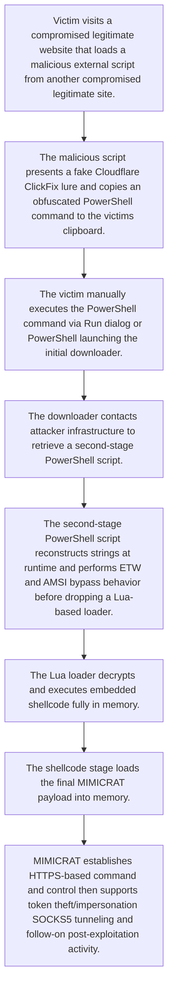

# MIMICRAT ClickFix Campaign via Compromised Legitimate Websites

- Source: Clickfix
- Intake mode: link
- Reference: https://www.elastic.co/security-labs/mimicrat-custom-rat-mimics-c2-frameworks
- Risk level: high
- Confidence: high

## Executive Summary
Elastic Security Labs reported an active ClickFix campaign, published on February 20, 2026, that abuses compromised legitimate websites to socially engineer users into executing an obfuscated PowerShell command. The intrusion progresses through a five-stage chain involving a staged PowerShell downloader, ETW and AMSI bypass, a Lua-based shellcode loader, Meterpreter-related shellcode, and a custom Windows RAT named MIMICRAT. The malware supports malleable HTTPS C2, token theft/impersonation, and SOCKS5 tunneling. Based on the provided detection catalog, there is direct and material coverage for the PowerShell-based defense evasion and execution behavior associated with this campaign, but limited coverage for later-stage custom RAT activity and infrastructure-specific C2.

## Attack Diagram

## Existing Detection Coverage
- Coverage exists: yes
- Coverage summary: The catalog contains one strong, directly aligned detection for this exact campaign and one partial overlap for generic obfuscated PowerShell behavior. Coverage is strongest for the early execution and defense-evasion stages, especially PowerShell with AMSI/ETW bypass patterns. Coverage is limited for the Lua loader, shellcode stage, token theft/impersonation, SOCKS5 tunneling, and the custom HTTPS C2 behaviors of the final MIMICRAT implant.

- `Detections/elastic/mimicrat_clickfix_campaign_delivering_custom_rat_via_compromised_legitimate_websites_eql.yml`: Direct detection for the reported MIMICRAT ClickFix campaign; explicitly matches suspicious PowerShell with AMSI bypass, ETW tampering, and runtime string reconstruction described in the source.
- `Detections/APT29 - Cozy Bear/Defense Evasion - T1027.7.yml`: Partial behavioral overlap with stage 2 obfuscated PowerShell that reconstructs strings at runtime to evade static analysis, although it is not campaign-specific.

## Attack Logic
- Victim visits a compromised legitimate website that loads a malicious external script from another compromised legitimate site.
- The malicious script presents a fake Cloudflare ClickFix lure and copies an obfuscated PowerShell command to the victim's clipboard.
- The victim manually executes the PowerShell command via Run dialog or PowerShell, launching the initial downloader.
- The downloader contacts attacker infrastructure to retrieve a second-stage PowerShell script.
- The second-stage PowerShell script reconstructs strings at runtime and performs ETW and AMSI bypass behavior before dropping a Lua-based loader.
- The Lua loader decrypts and executes embedded shellcode fully in memory.
- The shellcode stage loads the final MIMICRAT payload into memory.
- MIMICRAT establishes HTTPS-based command and control, then supports token theft/impersonation, SOCKS5 tunneling, and follow-on post-exploitation activity.

## Impacted Systems
- Windows endpoints
- Windows PowerShell environments
- User workstations browsing compromised websites

## Likely Targets
- Users lured to compromised legitimate websites
- Organizations with Windows endpoints
- Opportunistic enterprise and institutional victims
- Internet-facing users likely to trust legitimate web services

## TTPs
- ClickFix social engineering via fake verification prompt
- User-assisted execution of clipboard-delivered PowerShell
- Obfuscated PowerShell string reconstruction at runtime
- AMSI bypass
- ETW tampering or bypass
- In-memory shellcode execution
- Lua-based loader execution
- HTTPS command and control over port 443
- Malleable HTTP C2 profiles
- Token theft or impersonation
- SOCKS5 tunneling

## Tooling And Malware
- PowerShell
- Lua 5.4.7 loader
- Meterpreter-related shellcode
- MIMICRAT

## Indicators Of Compromise
| Type | Value | Context |
| --- | --- | --- |
| domain | bincheck.io | Compromised legitimate victim-facing entry point used in the delivery chain. |
| domain | investonline.in | Compromised legitimate site hosting the ClickFix JavaScript payload. |
| url | https://www.investonline.in/js/jq.php | Malicious external script impersonating jQuery and delivering the ClickFix lure. |
| domain | xMRi.neTwOrk | Stage 1 downloader domain reconstructed by the obfuscated PowerShell command. |
| ip | 45.13.212.250 | Infrastructure associated with xMRi.neTwOrk and WexMrI.CC for payload delivery. |
| domain | WexMrI.CC | Additional domain resolving to 45.13.212.250 identified through infrastructure pivoting. |
| ip | 45.13.212.251 | Infrastructure cluster associated with initial payload delivery. |
| ip | 23.227.202.114 | Post-exploitation C2 infrastructure cluster. |
| domain | www.ndibstersoft.com | Observed as associated with post-exploitation beacon communications. |
| domain | d15mawx0xveem1.cloudfront.net | CloudFront domain confirmed as part of MIMICRAT C2 infrastructure. |
| uri | /intake/organizations/events?channel=app | GET profile URI pattern identified in MIMICRAT C2 communications. |
| file | rgen.zip | Sample noted as contacting the CloudFront C2 relay. |
| file | jq.php | External script name used to deliver the ClickFix lure. |
| crypto_key | @z1@@9&Yv6GR6vp#SyeG&ZkY0X74%JXLJEv2Ci8&J80AlVRJk&6Cl$Hb)%a8dgqthEa6!jbn70i27d4bLcE33acSoSaSsq6KpRaA7xDypo(5 | RC4 key used to encrypt the CloudFront C2 hostname in the MIMICRAT configuration. |
| crypto_iv | abcdefghijklmnop | Hardcoded AES IV used by MIMICRAT for C2 traffic encryption. |

## Recommendations
- Prioritize deployment and tuning of the existing MIMICRAT ClickFix PowerShell detection across Windows telemetry sources.
- Hunt for PowerShell processes with obfuscated command lines, runtime string reconstruction, AMSI bypass references, ETW-related tampering, and minimized-window execution patterns.
- Inspect outbound HTTPS connections from newly spawned PowerShell or suspicious child processes to campaign-linked domains and IPs.
- Block or monitor known campaign infrastructure and investigate any historical communication with the identified delivery or C2 endpoints.
- Review browser-to-PowerShell execution chains and user-initiated Run dialog activity associated with suspicious clipboard-driven commands.
- Hunt for unsigned or unusual Lua-related binaries and memory-resident shellcode execution on Windows endpoints.
- Evaluate detections for post-exploitation behaviors not well covered in the current catalog, including token impersonation, SOCKS5 proxying, and custom HTTPS beaconing.

## References
- https://www.elastic.co/security-labs/mimicrat-custom-rat-mimics-c2-frameworks
