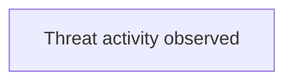

# Unable to verify Stormshield source for MIMICRAT ClickFix campaign

- Source: clickfixUpdated
- Intake mode: link
- Reference: https://www.stormshield.com/news/investigations-into-the-mimicrat-clickfix-campaign/
- Risk level: unknown
- Confidence: low

## Executive Summary
I could not retrieve the referenced Stormshield article from the allowed domain, so I cannot safely extract threat intelligence or compare it against the detection catalog without risking unsupported conclusions.

## Attack Diagram

## Existing Detection Coverage
- Coverage exists: no
- Coverage summary: Coverage could not be assessed because the referenced Stormshield source was not retrievable from the allowed domain during verification, so no supported campaign behaviors were available for comparison.

_No matching detections were identified._

## Attack Logic
_No attack logic returned._

## Impacted Systems
_No impacted systems returned._

## Likely Targets
_No likely targets returned._

## TTPs
_No TTPs returned._

## Tooling And Malware
_No tooling returned._

## Indicators Of Compromise
_No IOCs extracted._

## Recommendations
- Provide the full text of the Stormshield article or a reachable copy from www.stormshield.com.
- Re-run the analysis once the source content is available so I can extract supported IOCs and compare them to the catalog.

## References
- https://www.stormshield.com/news/investigations-into-the-mimicrat-clickfix-campaign/
